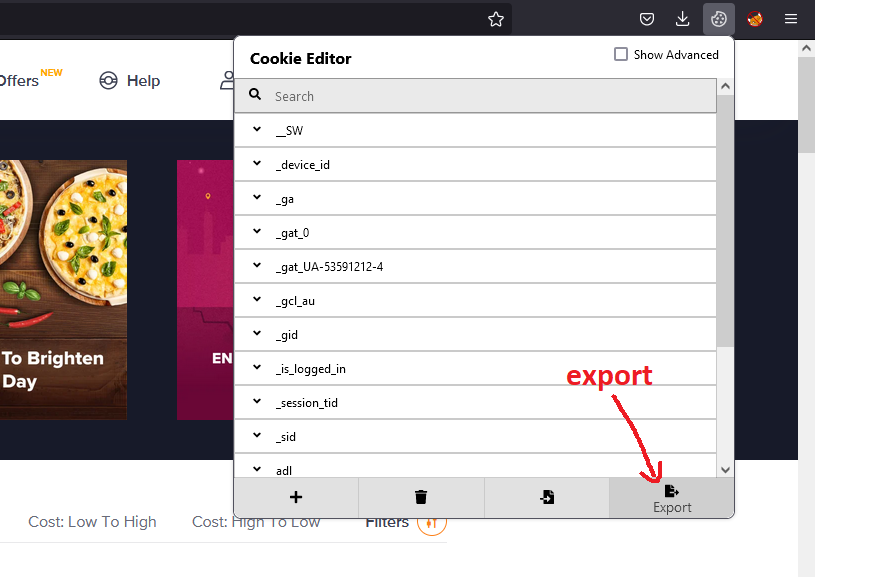

# Swiggy Total Money Spent

This script retrieves all your swiggy orders and calculates the toal money you spent on [swiggy.com](https://www.swiggy.com).

Also shows the number of orders and average money you spent on each order.

# How to use
The script expects you to give your swiggy session as input.
- Login to swiggy.com on a browser (chrome or firefox)
- Install the [Cookie Editor chrome extension](https://chrome.google.com/webstore/detail/cookie-editor/hlkenndednhfkekhgcdicdfddnkalmdm?hl=en) or the [Cookie Editor firefox extension](https://addons.mozilla.org/en-US/firefox/addon/cookie-editor/)
- Go to the Swiggy tab and click on the Extension's icon, and select "Export". This will copy your cookies to clipboard

- Create a new file called `cookies.json` in the same directory as the `swiggy.py` script and paste the copied cookies into this file.
- Install requirements with `pip`
  ```
  pip install -r requirements.txt
  ```
- Now simply run `swiggy.py`
  ```
  python swiggy.py
  ```